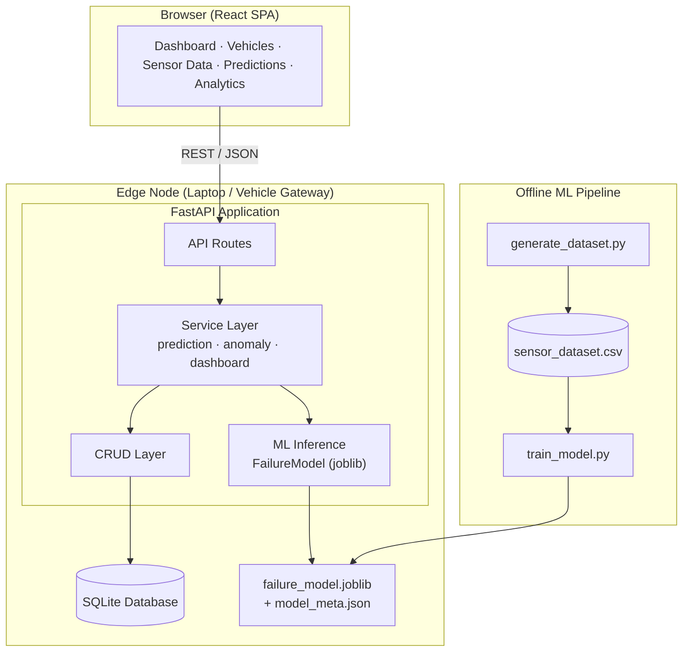
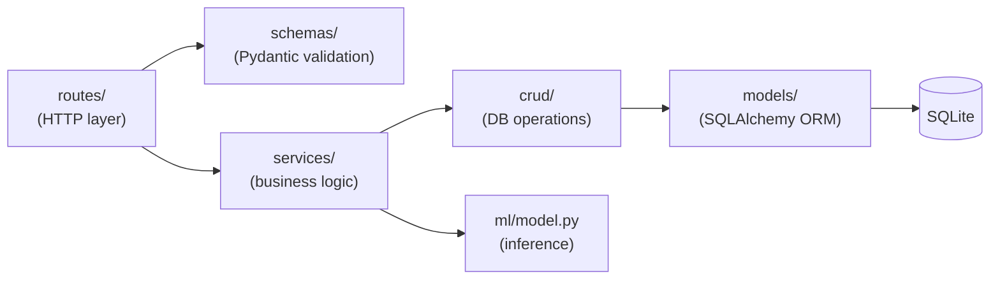
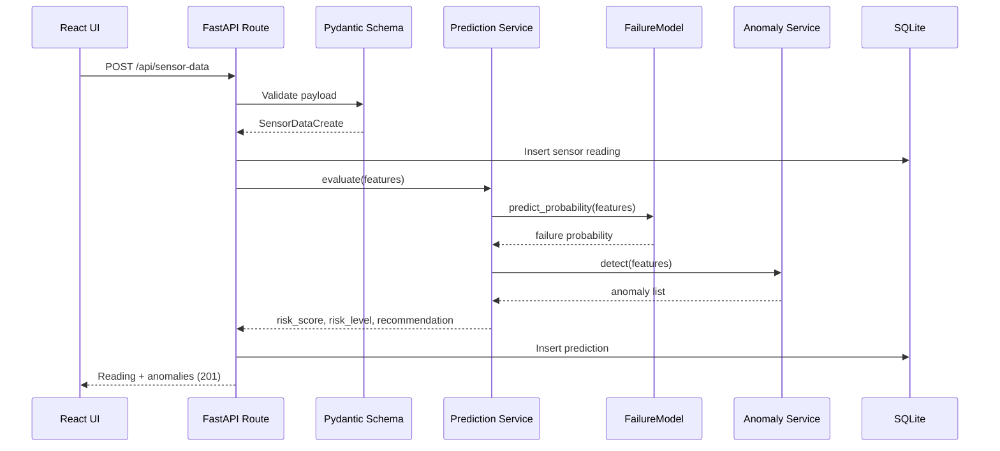
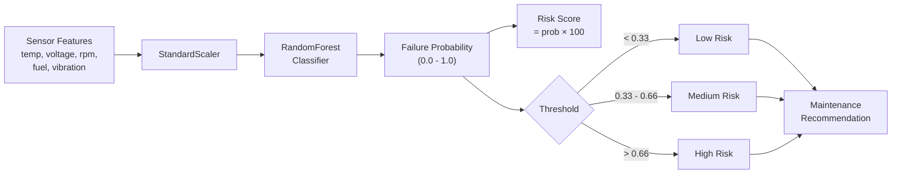

# AutoCare AI — Architecture

AutoCare AI is an Edge-AI predictive maintenance platform. A trained ML model runs **locally** next to the API (the "edge"), scoring vehicle sensor telemetry in real time without any cloud dependency.

## System Architecture

## Layered Backend Design

Each layer has a single responsibility:

| Layer | Responsibility |
|-------|----------------|
| `routes` | HTTP request/response, status codes, dependency injection |
| `schemas` | Request/response validation and serialization (Pydantic v2) |
| `services` | Business logic: scoring, anomaly rules, dashboard aggregation |
| `crud` | Reusable database queries |
| `models` | ORM table definitions |
| `ml` | Model loading and inference (with heuristic fallback) |

## API Flow — Submitting a Sensor Reading

## Prediction Flow

## Why "Edge AI"

- The model is a compact serialized artifact (`joblib`) — no GPU, no network round-trips.
- Inference latency is sub-millisecond on CPU, suitable for an in-vehicle gateway.
- The system degrades gracefully: if the model file is missing, a deterministic **heuristic scorer** takes over so monitoring never stops.
- Everything runs on a single laptop with SQLite — zero external infrastructure.
