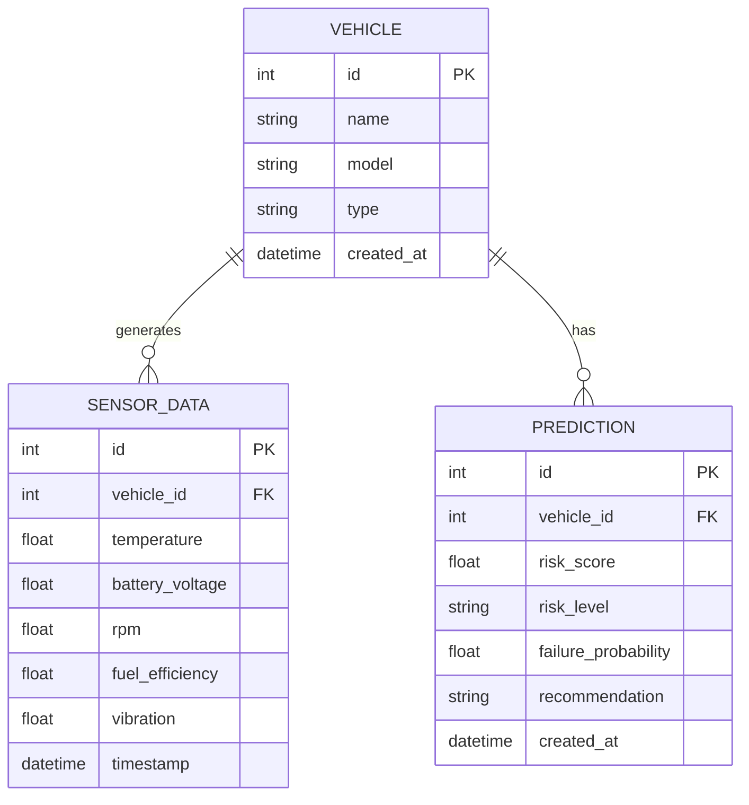

# AutoCare AI — Database Design

The system uses **SQLite** via **SQLAlchemy 2.0** ORM. Three tables model the domain: vehicles, their sensor telemetry, and the predictions generated from that telemetry.

## Entity-Relationship Diagram

## Tables

### `vehicles`
| Column | Type | Notes |
|--------|------|-------|
| id | INTEGER | Primary key |
| name | VARCHAR(120) | Display name |
| model | VARCHAR(120) | Make/model |
| type | VARCHAR(60) | car, truck, van, bus, motorcycle |
| created_at | DATETIME | UTC creation timestamp |

### `sensor_data`
| Column | Type | Notes |
|--------|------|-------|
| id | INTEGER | Primary key |
| vehicle_id | INTEGER | FK → vehicles.id (cascade delete) |
| temperature | FLOAT | Engine temperature (°C) |
| battery_voltage | FLOAT | Battery voltage (V) |
| rpm | FLOAT | Engine RPM |
| fuel_efficiency | FLOAT | Fuel efficiency (km/L) |
| vibration | FLOAT | Vibration level |
| timestamp | DATETIME | Indexed for time-series queries |

### `predictions`
| Column | Type | Notes |
|--------|------|-------|
| id | INTEGER | Primary key |
| vehicle_id | INTEGER | FK → vehicles.id (cascade delete) |
| risk_score | FLOAT | 0–100 |
| risk_level | VARCHAR(20) | Low / Medium / High |
| failure_probability | FLOAT | 0.0–1.0 |
| recommendation | VARCHAR(500) | Generated maintenance advice |
| created_at | DATETIME | Indexed |

## Relationships & Integrity
- A **Vehicle** has many **SensorData** readings and many **Predictions**.
- Foreign keys use `ON DELETE CASCADE`; deleting a vehicle removes its readings and predictions.
- SQLAlchemy relationships use `cascade="all, delete-orphan"` to keep ORM and DB consistent.
- Tables are auto-created at application startup via `init_db()`.
